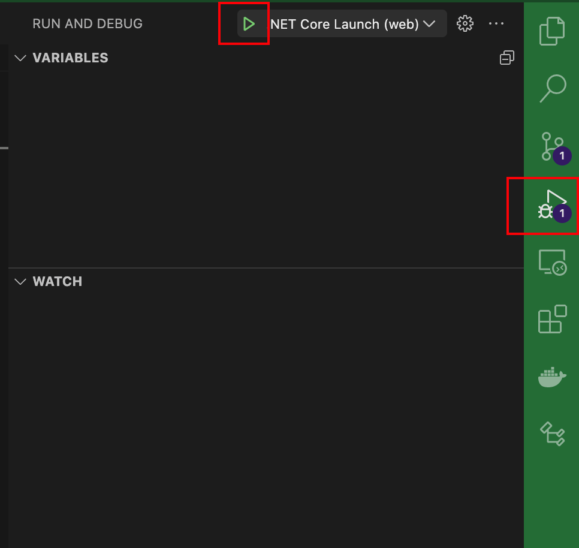

# Development

1. setup

    * Make sure you have downloaded the dotnet SDK and included it in your PATH
    * for my machine (MacOS) I placed dotnet into /usr/local/share/dotnet/* because that's where the path needs to be for me to type `dotnet run` or `dotnet build` and the terminal access the sdk this way to compile the code
    * From my understanding the .NET SDK is built into Visual Studio, whereas vscode has to have configuration files to grab the SDK because it is not integrated into vscode directly. 

    ```sh
    cd ClientApp; npm install;
    ```
    - press play on debug mode, launch and build tasks should start the application in debug mode with full breakpoint troubleshooting capability

    


- This project was created to be ran inside vscode, the most optimal way to run this is within the debugger.
- This is a c# backend with angular 13 frontend SPA full-stack application.
- There is a lot of configuration behind this. I find that it works best by hitting the green play button inside the debugger tab, all the scripts necessary will run. The front end has a proxy redirect whenever the page is refereshed the development server intercepts these GET requests that are made during client side routing to just keep serving the html of the front end SPA. 
- Sorry in advance for anybody using visual studio :( I hope this is a straightforward explanation
- Any troubleshooting of the API can be done via Postman or Insomnia via https, if you rather not try to navigate the client to find where the endpoint request is made. With Insomnia you'll have to disable SSL verification to make the requests without entering an SSL key
- All requests are made with a development certificate via `https://localhost:44456/` currently. This is maybe the intended way to make requests to the API by the client making requests to itself but sometimes this doesn't work for some reason. I changed my client to make requests directly to the server address: `https://localhost:7204/api/` as the development BASE_URL injected to the client service classes when making http requests. This seemed to be the only address the works on Insomnia. and then had to set cors policy for the 44456 localhost address so the server lets requests from that origin to make requests to the server's separate origin. This is the only way that consistently works. The proxying I don't understand fully and doesn't always work.  
